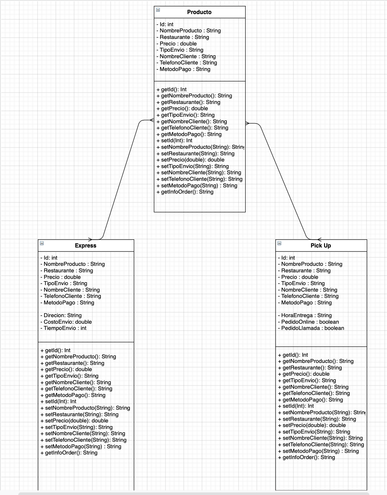

# Project - OOP Java course

## Table of contents
* [About the project](#about-the-project)
* [Built with](#built-with)
* [Getting started](#getting-started)
    - [Prerequisites](#prerequisites)
* [UML](#uml)

## About The Project
This project is about the OOP course using JAVA.

## Built With
This project is created with:
* Programming Lenguage: JAVA
* Java libreries
* IDE IntelliJ

## Getting started
## Prerequisites
In order to get the project locally to run the project you need to have installed:

* Java installed
* IDE (Eclipse, IntelliJ, etc)

## UML Diagram

