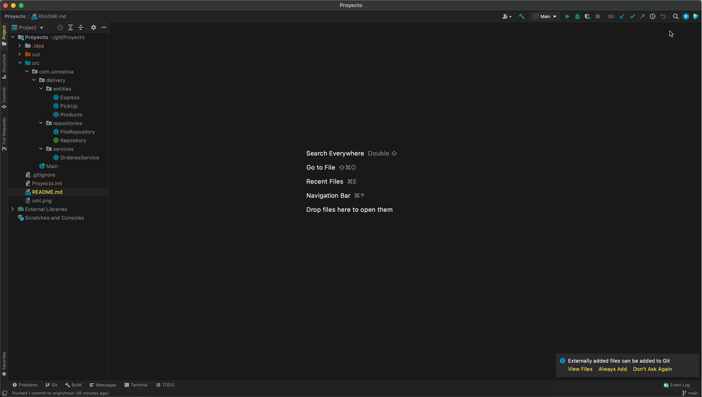

# Project - OOP Java course

## Table of contents
* [About the project](#about-the-project)
* [Built with](#built-with)
* [Getting started](#getting-started)
    - [Prerequisites](#prerequisites)
* [UML](#uml-diagram)

## About The Project
This project is about the OOP course using JAVA.
Looks something like this, once you've done everything.

## Built With
This project is created with:
* Programming Lenguage: JAVA
* Java libreries
* IDE IntelliJ

## Getting started
## Prerequisites
In order to get the project locally to run the project you need to have installed:

* Java installed
* IDE (Eclipse, IntelliJ, etc)

## UML Diagram

This diagram try to explain a Delivery Software, it has a "Product" class which is abstract and the main class, and we have "Express" and "Pick Up" which extends from Product.
Express and Pick Up are kind of classes that try to show tha ways that the customer can order a products.

